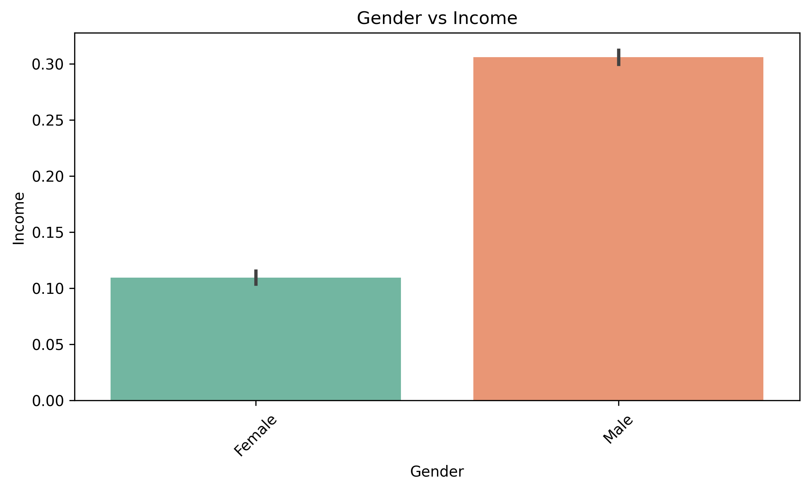
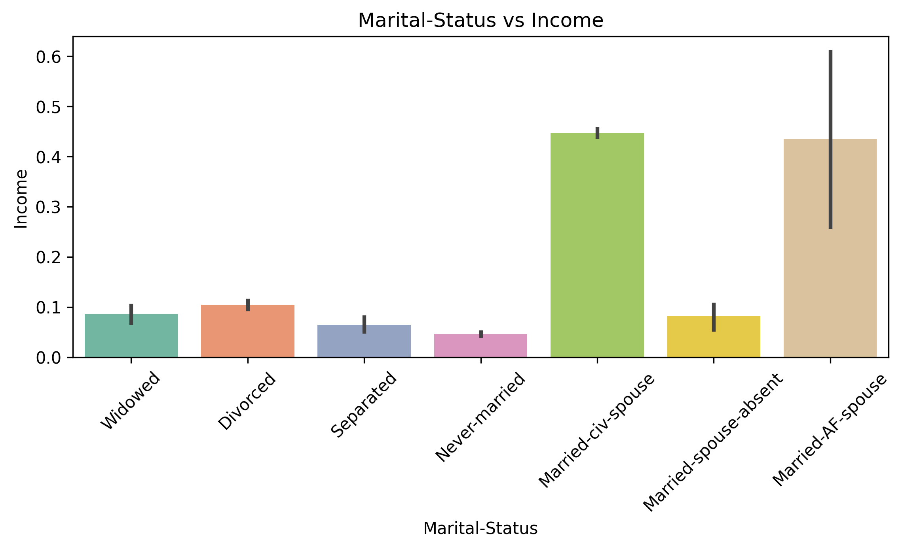
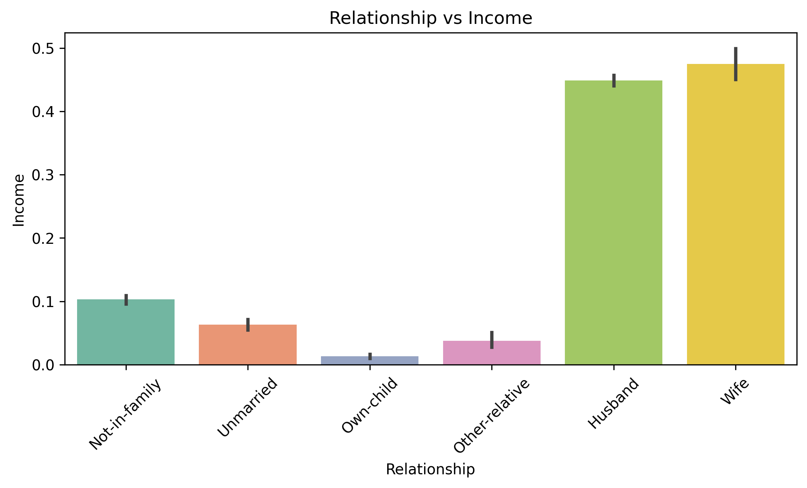
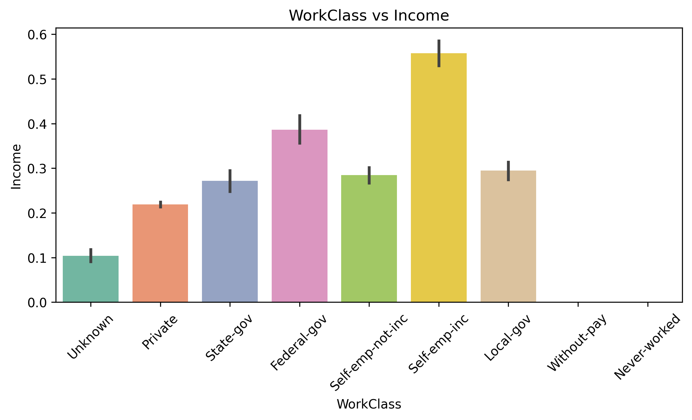

# Python-Project-2026
Adult Income Analysis – End-to-End Data Workflow (Python)

## Project Overview

This project analyses demographic and employment data to identify key factors influencing whether an individual earns above or below $50K annually.

The objective was to transform raw, incomplete data into meaningful, actionable insights while building a reusable and automated data workflow using Python.

The project demonstrates core data analyst skills including:

 * Data cleaning and preparation
 * Exploratory data analysis (EDA)
 * Insight generation
 * Workflow automation
 * Model validation for decision support

### Gender vs Income

Individuals in the male category show a higher probability of earning above $50K compared to females, indicating a potential income disparity across gender groups within the dataset.

### Marital Status vs Income

Married individuals demonstrate a higher likelihood of earning above $50K, suggesting possible links to career stability, experience level, or dual-income household dynamics.

### Relationship Status vs Income
Certain relationship categories (e.g. Husband) are strongly associated with higher income levels, reinforcing patterns observed in marital status analysis.

### WorkClass vs Income
Income distribution varies significantly across employment types. While the private sector represents the largest group, other work classes show different earning patterns, indicating structural differences in income potential.

### Education vs Income
Higher levels of education are strongly associated with increased probability of earning above $50K, highlighting education as a key driver of income.

## Visualisations

### Gender vs Income

### Marital Status vs Income

### Relationship Status vs Income

### WorkClass vs Income

## Methodology
### 1. Data Cleaning & Preparation
. Converted missing values (?) into nulls

. Handled missing categorical data using an "Unknown" category

. Ensured consistent data structure for analysis

### 2. Exploratory Data Analysis (EDA)
. Analysed relationships between demographic features and income

. Used bar plots to identify patterns and trends

. Focused on interpretability for business understanding

### 3. Data Transformation & Modelling
. Built a reusable preprocessing pipeline using:

  . ColumnTransformer
  
  . OneHotEncoder for categorical variables
  
  . StandardScaler for numerical features

  ### 4. Model Validation
  . Applied Stratified K-Fold Cross-Validation to ensure reliable performance
  
  . Evaluated models using:

  . ROC-AUC

  . F1 Score

  ### 5. Workflow Automation
  . Structured the project into modular functions

  . Automated:
    
   . Data loading
   
   . Cleaning
   
   . Transformation
   
   . Model training
   
   . Evaluation
   
   . Output generation

. Saved outputs programmatically:

   . Model comparison results
   
   . Evaluation metrics
   
   . Predictions

   . Visualisations    

   ## Model Performance
   . [Model Comparison Results](Plots/model_comparison.xlsx) – Cross-validated model performance 

   . [Evaluation Metrics](Plots/evaluation_metrics.xlsx) – ROC-AUC, F1, Precision, Recall 

   . [Confusion Matrix](Plots/confusion_matrix.png) – Visual representation of classification performance

  
  
  ## Tools & Technologies
  
  ### Python
  . Pandas
  
  . NumPy
  
  . Scikit-learn
  
  . Seaborn / Matplotlib

 ### Techniques
 . Data Cleaning 
 
 . Feature Engineering
 
 . Cross-Validation
 
 . Pipeline Automation

 
   
  
